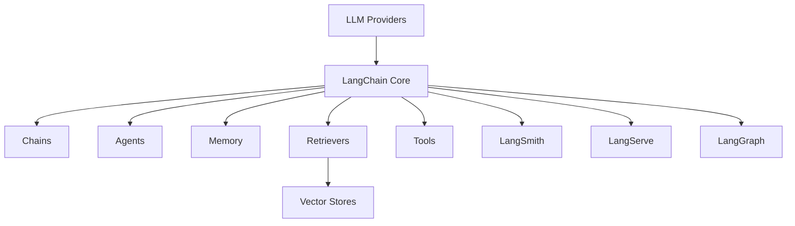
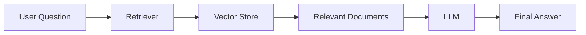
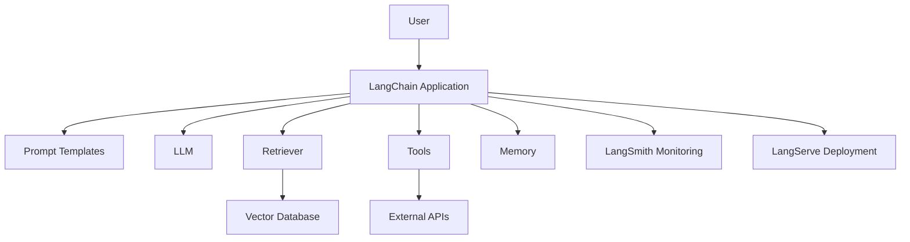

# LangChain Ecosystem

The **LangChain Ecosystem** is a collection of libraries, tools, and platforms built around **LangChain** to help developers create production-ready applications powered by Large Language Models (LLMs).

LangChain simplifies building applications that combine:

- LLMs (e.g., OpenAI, Anthropic, open-source models)
- External data sources (databases, APIs, files)
- Memory
- Agents
- Tool usage
- Retrieval systems

---

# 🌍 What Is LangChain?

LangChain is an open-source framework designed to build LLM-powered applications using composable components like prompts, chains, agents, tools, and retrievers.

It provides:

- Abstractions for LLMs
- Data connection interfaces
- Memory management
- Agent orchestration
- Evaluation tools

---

# 🏗️ LangChain Ecosystem Overview

Below is the ecosystem structure:



---

# 🧩 Core Components

## 1️⃣ LangChain Core

The main framework that provides:

- Prompt templates
- Output parsers
- Runnables
- LLM wrappers
- Chat model abstractions

It acts as the orchestration layer between models and data.

---

## 2️⃣ Chains

Chains are sequences of operations.

Example:

```
User Input → Prompt Template → LLM → Output Parser
```

Types:

- LLMChain
- SequentialChain
- RouterChain
- RetrievalQA

Chains are deterministic workflows.

---

## 3️⃣ Agents

Agents decide dynamically which tools to use.

Instead of fixed steps, they:

1. Receive a goal
2. Reason about it
3. Select tools
4. Execute actions
5. Iterate

Agents are useful for:

- Autonomous systems
- Tool-based reasoning
- Multi-step problem solving

---

## 4️⃣ Tools

Tools are external capabilities that agents can use.

Examples:

- Web search
- Python execution
- Database queries
- API calls
- Calculators

Tools extend LLM capability beyond text generation.

---

## 5️⃣ Memory

Memory allows applications to store conversation state.

Types:

- ConversationBufferMemory
- ConversationSummaryMemory
- VectorStoreMemory

Memory enables:

- Persistent context
- Long-term reasoning
- Stateful chatbots

---

## 6️⃣ Retrievers & Vector Stores

Retrievers allow LLMs to access external knowledge.

Common workflow (RAG – Retrieval-Augmented Generation):



Vector stores:

- FAISS
- Chroma
- Pinecone
- Weaviate

This enables knowledge-grounded responses.

---

# 🚀 Extended Ecosystem Projects

## 🧪 LangSmith

LangSmith is a debugging and evaluation platform.

It provides:

- Tracing
- Experiment tracking
- Dataset management
- Prompt evaluation
- Performance monitoring

Useful for production deployment.

---

## 🌐 LangServe

LangServe allows you to deploy LangChain apps as APIs.

Features:

- FastAPI integration
- Automatic route generation
- Streaming support
- Cloud deployment ready

---

## 🔄 LangGraph

LangGraph enables stateful, multi-step agent workflows.

It is ideal for:

- Complex reasoning pipelines
- Multi-agent systems
- Cyclical workflows
- Long-running tasks

LangGraph is built on top of LangChain but optimized for structured control flows.

---

# 🧠 How Everything Fits Together



---

# 🏢 Typical Use Cases

- Chatbots with memory
- Document Q&A systems (RAG)
- Autonomous AI agents
- Research assistants
- Code copilots
- Multi-tool AI systems
- Enterprise knowledge bots

---

# 📊 Ecosystem Layers

| Layer           | Responsibility          |
| --------------- | ----------------------- |
| LLM Layer       | Model inference         |
| Orchestration   | Chains & Agents         |
| Knowledge Layer | Vector DB + Retrieval   |
| State Layer     | Memory                  |
| Tool Layer      | APIs & external actions |
| Observability   | LangSmith               |
| Deployment      | LangServe               |
| Workflow Engine | LangGraph               |

---

# 🎯 Why LangChain Is Important

- Standardizes LLM app development
- Encourages modular design
- Enables production deployment
- Supports RAG and Agents
- Large ecosystem & community

---

# 🏁 Summary

The LangChain ecosystem is not just a library — it is a **complete framework for building intelligent, data-aware, tool-using LLM applications**.

It includes:

- Core orchestration
- Retrieval pipelines
- Agents
- Memory
- Debugging & evaluation
- Deployment tools
- Workflow engines

Together, these components make LangChain one of the most powerful ecosystems for building real-world LLM systems.
